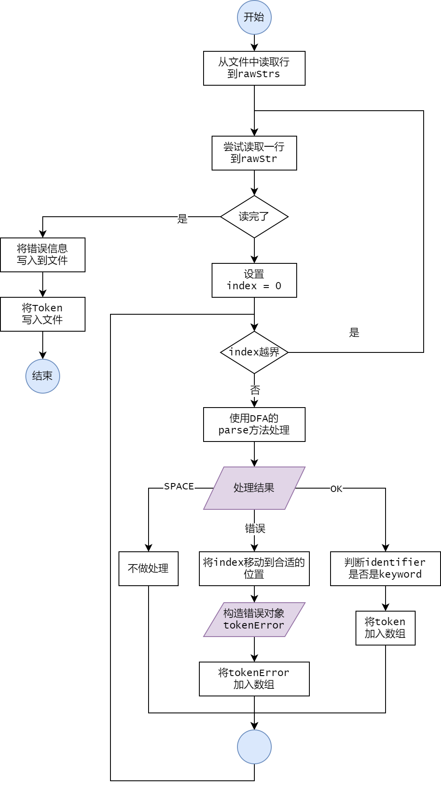

#### <span style="color:#0202c0;">输出格式说明</span>

- 首先输出错误信息：

```
#Errors: 12
at line 1, column 2: 非法字符 "#"
at line 11, column 18: 错误的开始字符 "_APPosition_Input"
...
```

- 然后输出`Token`：

```
#Token: 
...
#line 3
KEYWORD int
IDENTIFIER a
SYMBOL ;
...
```

#### <span style="color:#0202c0;">词法分析流程图</span>



#### <span style="color:#0202c0;">错误处理过程</span>


