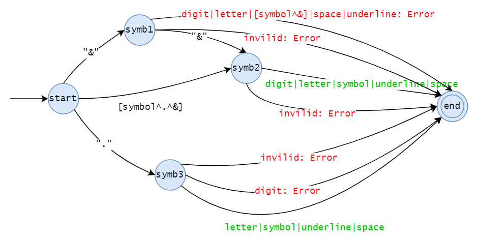
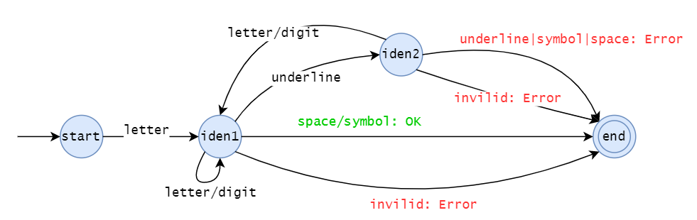
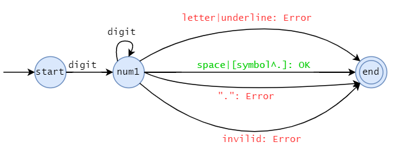
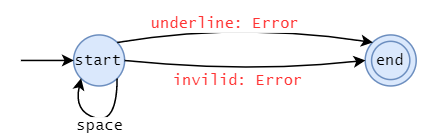

#### 字符类型：

```cpp
enum class CharType {
	DIGIT,				// 数字： 0-9
	LETTER,				// 字母： A-Za-z
	UNDERLINE,		// 下划线 '_'
	SYMBOL,				// 符号：各种专用符号
	SPACE,				// 空白字符：空格，制表符
	INVILID,			// 其他非法字符
};
```

#### `Token`分类：

```cpp
enum class TokenType {
	KEYWORD,			// 关键字
	SYMBOL,				// 专用符号
	IDENTIFIER,		// 标识符
	NUMBER				// 整型数字
};
```


#### <span style="color:#0202c0;">状态转换图</span>

- 红色线条表示错误返回，绿色线条表示识别到了`Token`然后返回。

##### 识别专用符号



- 设计`symb1`状态，是为了识别`&&`符号。
- `[sysbol^.^&]`表示非`.`和非`&`的专用符号。
- 设计`symb3`状态，可以识别到浮点数错误，如`.23`

##### 识别identifier



##### 识别整型



- 状态`num1`，可以识别到浮点数错误，如`23.4`

##### 其他



- 遇到空白字符（空格，换行，制表），状态不变；
- 遇到下划线，报错，如`_foo`
- 遇到非法字符，报错，如`#`

