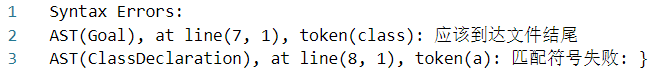
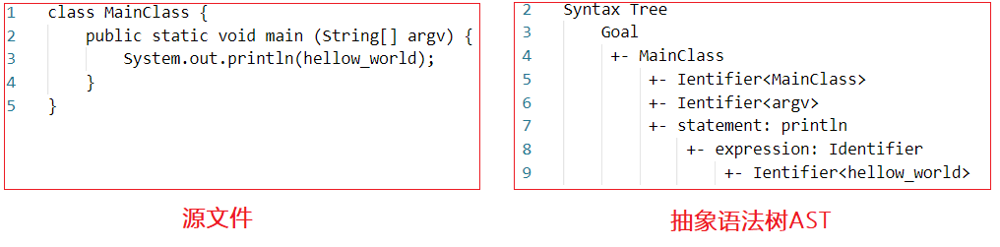
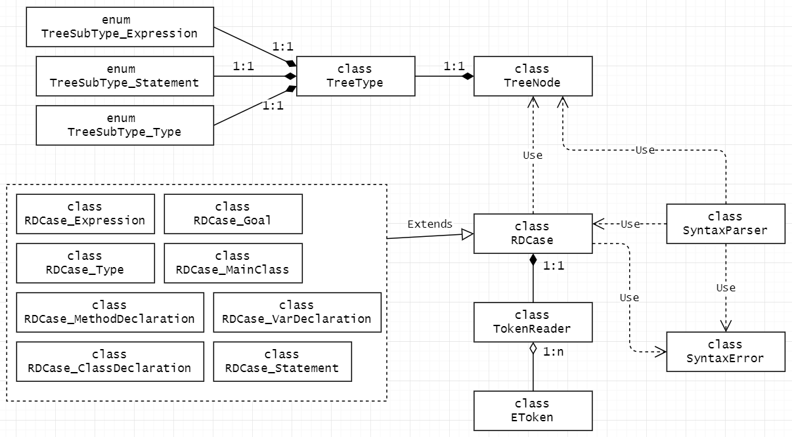
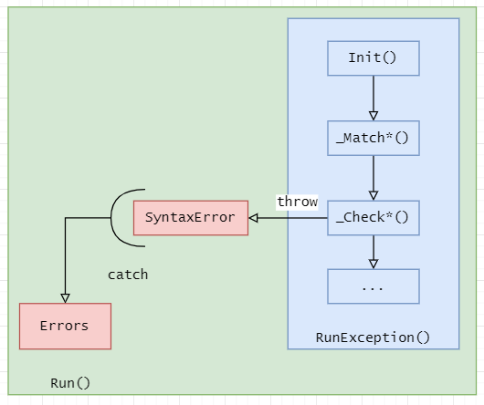
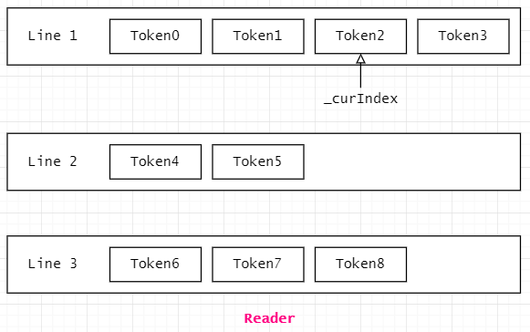

#### <span style="color:#0202c0;">可执行文件的命令行参数</span>

```shell
./SyntacticParser.exe <source.txt> <SyntaxOut.txt>
```

命令行需要两个参数

- 源文件的路径，源文件即为源代码，不是词法分析的结果
- 语法分析结果文件的路径


#### <span style="color:#0202c0;">语法分析结果的说明</span>

结果文件会首先显示错误信息（如果有语法错误的话）：

##### 1. 错误信息

错误信息以堆栈的形式打印出来，如图所示：





上图表示：在识别`Goal`时发生了错误，进一步的错误原因是识别`ClassDeclaration`时发生了错误。错误位于第8行第一个单词，此处本应该是符号`"}"`，实际却是单词`"a"`。


然后会显示抽象语法树的信息（如果没有语法错误的话）：

##### 2. 抽象语法树的信息

抽象语法树如下图右所示：



左边是源代码，右边是抽象语法树的序列化形式。抽象语法树需要对照抽象语法树定义来看（见：抽象语法树.pdf）。

有图与以下形式等同：


#### <span style="color:#0202c0;">源代码说明</span>

##### 1. 开发环境

- 语言：`C++`
- 开发平台：`Windows10 x64`，`visual studio 2020`
- 依赖包：`gTest`

- 算法：==递归下降==

##### 2. 源代码的结构：

```cpp
源代码
 ├── LexicalAnalyzer：语法分析依赖的词法分析
 ├── SyntacticParser：语法分析的源代码
 └──  Syntax_Test：gTest的测试代码
```


#### <span style="color:#0202c0;">程序设计说明</span>

##### 1. 类图



- 一个`class RDCase_*`表示递归下降的一个产生式
- `class TokenReader`用于读取`token`，并且记录行号等信息。


##### 2. 递归下降的错误处理

使用基于异常的错误处理机制来处理递归下降过程中的错误。

`class RDCase`的大致结构如下：

```cpp
class RDCase {
public:
    Run() {
    	try {
        	RunException();
        }	catch ...
    }
protected:
    RunException() {}
};
```




##### 3. `TokenReader`的实现

`class TokenReader`用于读取`token`，内部使用一个指针记录位置：



