#### <span style="color:#0202c0;">`AST`节点的定义</span>

```cpp
class TreeNode {
	int lineNUm;			// 对应的行号
    TreeType treeType;		// 节点的类型
    int numValue;			// 节点的数字值
    string strValue;		// 节点的字符串值
    
    TreeNode* child;		// 子节点
    TreeNode* subling;		// 兄弟节点
};
```

节点的类型定义：

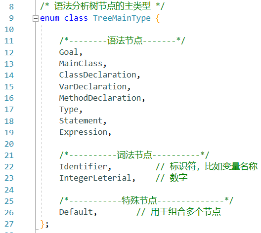

#### <span style="color:#0202c0;">`Goal`的AST节点</span>

| AST节点 | 产生式/描述                               | 图示                                                         |
| ------- | ----------------------------------------- | ------------------------------------------------------------ |
| `Goal`  | `Goal-> MainClass {ClassDeclaration} EOF` | 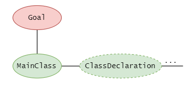 |


#### <span style="color:#0202c0;">`MainClass`的AST节点</span>

产生式：

```cpp
MainClass -> "class" Identifier "{" "public" "static" "void" "main" "(" "String" "[" "]" Identifier ")" "{" Statement "}" "}"
```

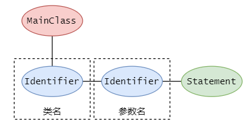


#### <span style="color:#0202c0;">`ClassDeclaration`的AST节点</span>

产生式

```cpp
ClassDeclaration -> "class" Identifier [ "extends" Identifier ] "{" { VarDeclaration } { MethodDeclaration } "}"
```

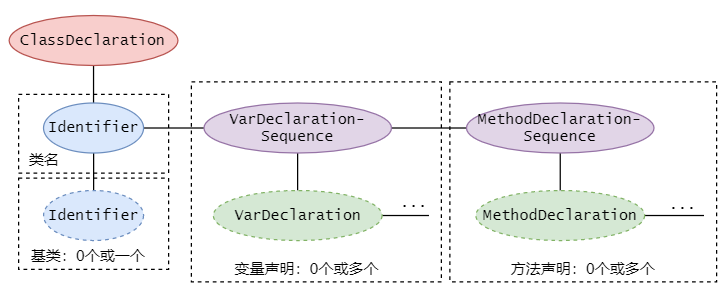

说明：紫色的节点代表一系列的可选节点，比如`{VarDeclaration}`和`{MethodDeclaration}`


#### <span style="color:#0202c0;">`VarDeclaration`的AST节点</span>

产生式

```cpp
VarDeclaration -> Type Identifier ";"
```

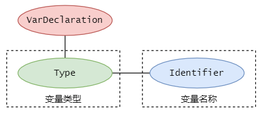


#### <span style="color:#0202c0;">`MethodDeclaration`的AST节点</span>

产生式：

```cpp
MethodDeclaration -> "public" Type Identifier "(" [ Type Identifier { "," Type Identifier } ] ")" "{" { VarDeclaration } { Statement } "return" Expression ";" "}"
```

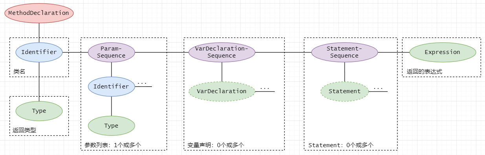


#### <span style="color:#0202c0;">`Type`的AST节点</span>

| 产生式/描述            | 图示                                                         |
| ---------------------- | ------------------------------------------------------------ |
| `Type -> "boolean"`    |  |
| `Type ->Identifier`    | 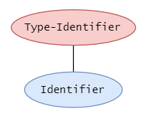 |
| `Type ->"int" "[" "]"` | 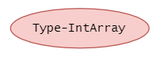 |
| `Type ->"int"`         | 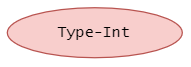 |


#### <span style="color:#0202c0;">`Statement`的AST节点</span>

| 产生式/描述                                                  | 图示                                                         |
| ------------------------------------------------------------ | ------------------------------------------------------------ |
| `Statement->"{" { Statement } "}"`                           | 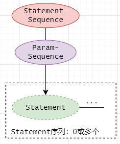 |
| `Statement->"if" "(" Expression ")" Statement "else" Statement` | 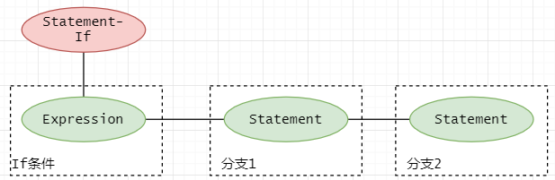 |
| `Statement->"while" "(" Expression ")" Statement`            | 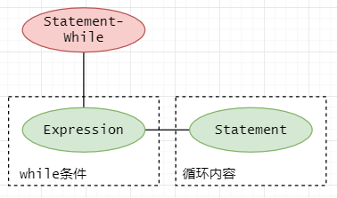 |
| `Statement->"System.out.println" "(" Expression ")" ";"`     | 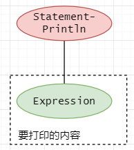 |
| `Statement->Identifier "=" Expression ";"`                   | 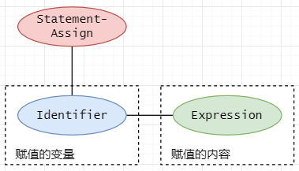 |
| `Statement-> Identifier "[" Expression "]" "=" Expression ";"` | 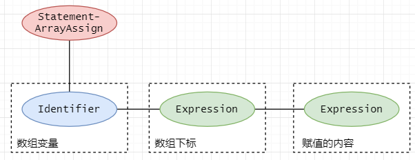 |


#### <span style="color:#0202c0;">`Expression`的AST节点</span>

| 产生式/描述                                                  | 图示                                                         |
| ------------------------------------------------------------ | ------------------------------------------------------------ |
| `Expression -> "(" Expression ")"`                           | 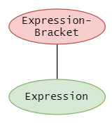 |
| `Expression -> "!" Expression`                               | 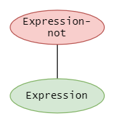 |
| `Expression -> "new" Identifier "(" ")"`                     | 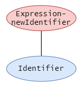 |
| `Expression -> "new" "int" "[" Expression "]"`               | 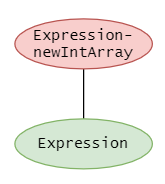 |
| `Expression -> "true"`                                       | 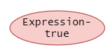 |
| `Expression -> "this"`                                       | 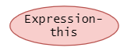 |
| `Expression -> "false"`                                      | 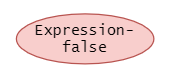 |
| `Expression -> Identifier`                                   | 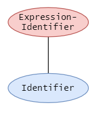 |
| `Expression -> IntegerLiteral`                               |  |
| `Expression -> Expression "[" Expression "]"`                | 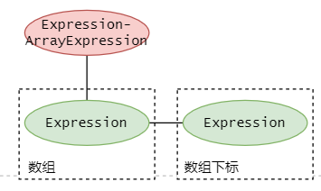 |
| `Expression -> Expression "."  "length"`                     | 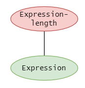 |
| `Expression -> Expression "." Identifier "(" [ Expression { "," Expression } ] ")"` | 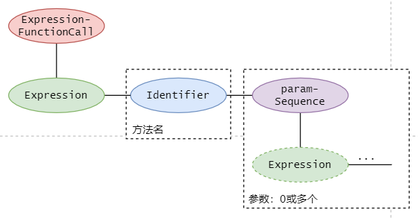 |
| `Expression -> Expression("&&"|"<"|"+"|"-"|"*") Expression `。运算符信息写在根节点的`strValue`域中 |  |

