[toc]

#### `MainClass`的测试

##### 测试1

产生式：

| 源代码                                                       | AST                                                          |
| ------------------------------------------------------------ | ------------------------------------------------------------ |
| 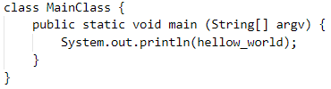 | 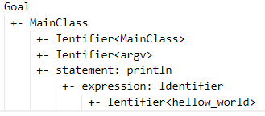 |

#### `ClassDeclaration`的测试

##### 测试1

产生式：

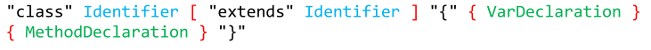

| 源代码                                                       | AST                                                          |
| ------------------------------------------------------------ | ------------------------------------------------------------ |
| 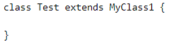 | 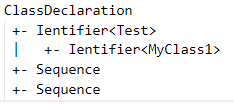 |

#### `VarDeclaration`的测试

##### 测试1

产生式：

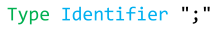

| 源代码                                                       | AST                                                          |
| ------------------------------------------------------------ | ------------------------------------------------------------ |
| 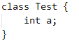 | 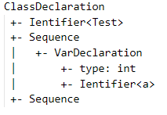 |

#### `MethodDeclaration`的测试

产生式：

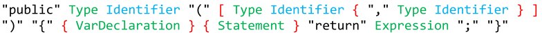

##### 测试1

| 源代码                                                       | AST                                                          |
| ------------------------------------------------------------ | ------------------------------------------------------------ |
| 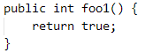 | 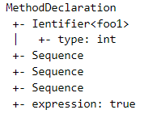 |

##### 测试2

| 源代码                                                       | AST                                                          |
| ------------------------------------------------------------ | ------------------------------------------------------------ |
| 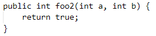 | 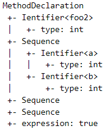 |

##### 测试3

| 源代码                                                       | AST                                                          |
| ------------------------------------------------------------ | ------------------------------------------------------------ |
| 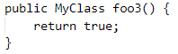 | 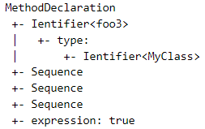 |

##### 测试4

| 源代码                                                       | AST                                                          |
| ------------------------------------------------------------ | ------------------------------------------------------------ |
| 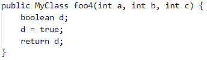 | 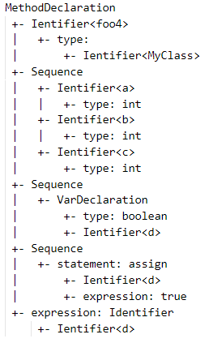 |

#### `Type`的测试

##### 测试1

产生式：

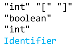

| 源代码                                                       | AST                                                          |
| ------------------------------------------------------------ | ------------------------------------------------------------ |
| 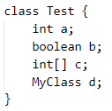 | 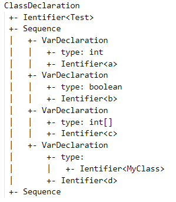 |

#### `Statement`的测试

##### 测试1

产生式：

| 源代码                                                       | AST                                                          |
| ------------------------------------------------------------ | ------------------------------------------------------------ |
| 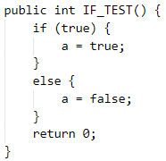 | 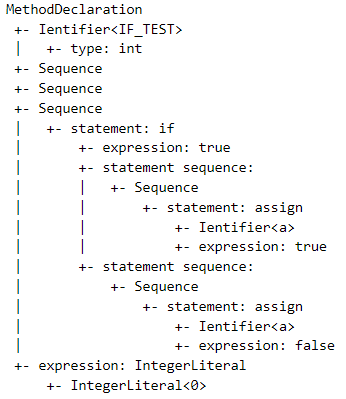 |

##### 测试2

产生式：

| 源代码                                                       | AST                                                          |
| ------------------------------------------------------------ | ------------------------------------------------------------ |
| 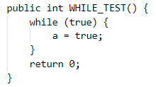 | 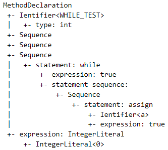 |

##### 测试3

产生式：

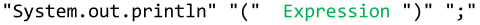

| 源代码                                                       | AST                                                          |
| ------------------------------------------------------------ | ------------------------------------------------------------ |
| 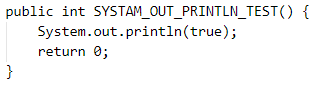 | 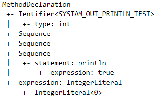 |

##### 测试4

产生式：

| 源代码                                                       | AST                                                          |
| ------------------------------------------------------------ | ------------------------------------------------------------ |
| 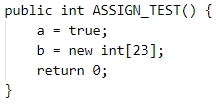 | 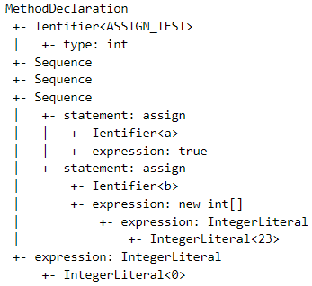 |

##### 测试5

产生式：

| 源代码                                                       | AST                                                          |
| ------------------------------------------------------------ | ------------------------------------------------------------ |
| 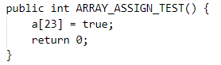 | 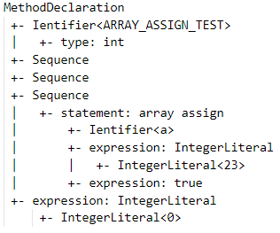 |

#### `Expression`的测试

##### 测试1

产生式：

| 源代码                                                       | AST                                                          |
| ------------------------------------------------------------ | ------------------------------------------------------------ |
| 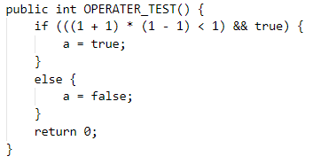 | 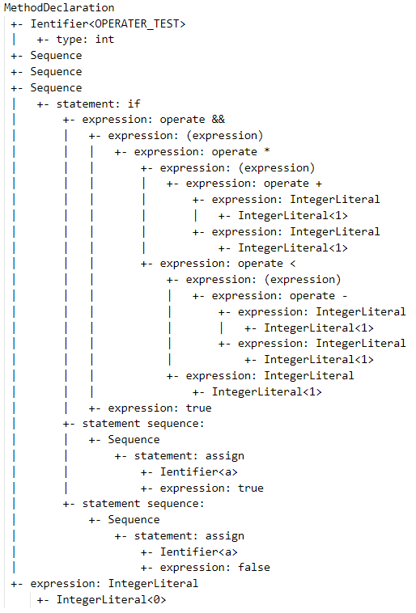 |

##### 测试2

产生式：

| 源代码                                                       | AST                                                          |
| ------------------------------------------------------------ | ------------------------------------------------------------ |
| 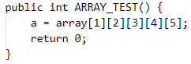 | 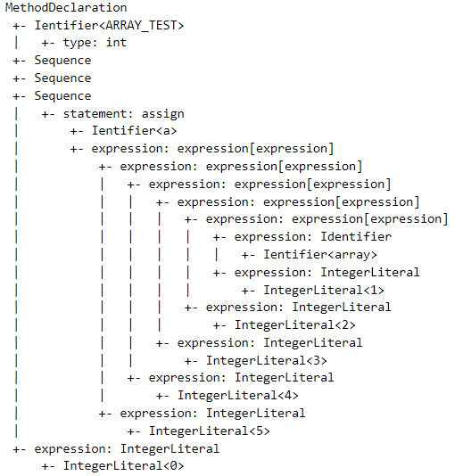 |

##### 测试3

产生式：

| 源代码                                                       | AST                                                  |
| ------------------------------------------------------------ | ---------------------------------------------------- |
| 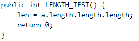 | 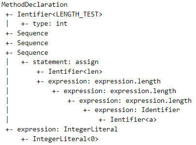 |

##### 测试4

| 源代码                                                       | AST                                                          |
| ------------------------------------------------------------ | ------------------------------------------------------------ |
| 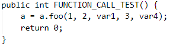 | 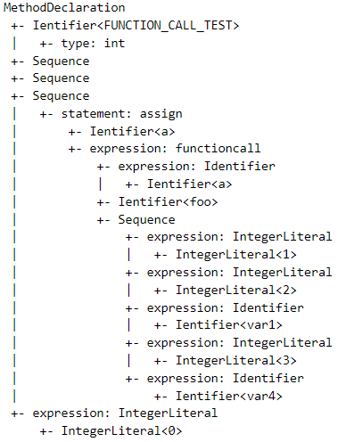 |

##### 测试5

产生式：

| 源代码                                                       | AST                                                          |
| ------------------------------------------------------------ | ------------------------------------------------------------ |
| 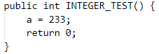 | 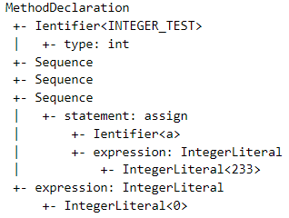 |

##### 测试6

产生式：

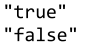

| 源代码                                                       | AST                                                          |
| ------------------------------------------------------------ | ------------------------------------------------------------ |
| 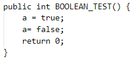 | 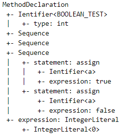 |

##### 测试7

产生式

| 源代码                                                       | AST                                                          |
| ------------------------------------------------------------ | ------------------------------------------------------------ |
| 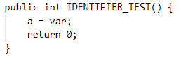 | 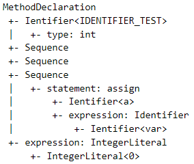 |

##### 测试8

产生式：

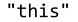

| 源代码                                                       | AST                                                          |
| ------------------------------------------------------------ | ------------------------------------------------------------ |
| 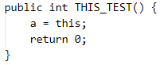 |  |

##### 测试9

产生式：

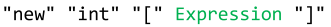

| 源代码                                                       | AST                                                          |
| ------------------------------------------------------------ | ------------------------------------------------------------ |
| 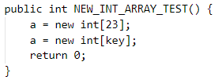 |  |

##### 测试10

产生式：

| 源代码                                                       | AST                                                          |
| ------------------------------------------------------------ | ------------------------------------------------------------ |
|  |  |

##### 测试11

产生式：

| 源代码                                                       | AST                                                          |
| ------------------------------------------------------------ | ------------------------------------------------------------ |
|  |  |

##### 测试12

产生式：

| 源代码                                                       | AST                                                          |
| ------------------------------------------------------------ | ------------------------------------------------------------ |
|  |  |

